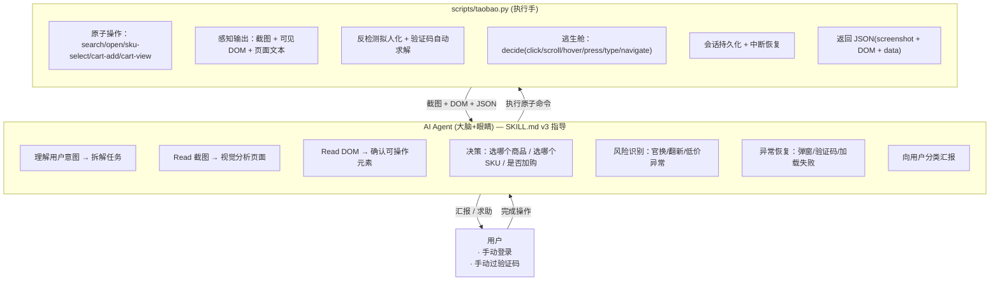

<div align="center">

# 🛒 淘宝自动挑货 · Taobao-Search-Skill

[](LICENSE)
[](https://www.python.org/)
[](https://playwright.dev/)
[](https://claude.ai/code)

</div>

> **AI Agent 作为视觉大脑替你逛淘宝** —— 实时看截图、读 DOM、做决策。不再填参数等结果，而是逐步操控浏览器：搜→看图→选商品→看图→选 SKU→看图→加购。每次操作后看截图决定下一步，完整自主推理链。

适用于 **Claude Code**、**Cursor**、**Copilot** 等 AI Agent 工具，也支持直接 CLI 调用。默认假设用户的模型支持多模态（视觉）。

## 架构



**核心设计变化：**
- v2：Agent 填参数 → 脚本一键跑完 → 返回 JSON → Agent 格式化汇报
- v3：Agent 看截图 → 决定下一步 → 调用原子命令 → 再看截图 → 循环... → Agent 自主判断结果

脚本降级为纯"手"——只执行具体操作（打开浏览器、点击、输入、截图），不做任何判断。Agent 做所有决策：选哪个商品、选哪个 SKU、价格是否在预算内、是否跳过风险商品。

### 双重感知：截图 + DOM

| 感知通道 | 来源 | 用途 |
|---------|------|------|
| **视觉** | `screenshot` PNG 文件（Read 工具查看） | 理解页面布局、识别弹窗、确认选中状态、发现风险关键词 |
| **DOM** | `dom` 子命令返回的语义标注结构 | 精确获取可选 SKU、按钮状态、元素坐标、禁用/选中标记 |

截图告诉你"页面长什么样"，DOM 告诉你"可以操作什么"。两者互补，缺一不可。

### 原子操作命令集

| 命令 | 作用 | 触发时机 |
|------|------|---------|
| `search --visual` | 搜索 + 截图搜索结果 | 开始新任务 |
| `open --index N` | 打开商品详情页截图 | 看中某个搜索结果 |
| `sku-select --label "颜色" --value "黑色"` | 选一个 SKU 选项 | 详情页看到 SKU 区 |
| `cart-add` | 加入购物车 | SKU 选好、价格确认 |
| `cart-view` | 查看购物车截图 | 全部加购后确认 |
| `dom` | 提取可见 DOM | 截图看不清或需精确数据 |
| `wait` | 等待条件满足 | 页面加载慢 |
| `decide --action click\|scroll\|hover\|press\|type\|navigate` | 通用逃生舱 | 弹窗、非标准操作 |

状态通过 `--task-id` 在命令间传递，每次命令独立打开/恢复会话/执行/截图/关闭。

### 决策归属审计（v3）

| 决策点 | 归属 | 依据 |
|--------|------|------|
| 看到搜索结果，选哪个商品打开 | **Agent** | 视觉分析 + 价格/销量判断 |
| 商品详情页选哪个 SKU | **Agent** | 看截图确认选项 + DOM 确认可选性 |
| 判断价格是否在预算内 | **Agent** | 视觉确认 + data 中的 price_value |
| 是否跳过风险商品（官换/翻新） | **Agent** | 看截图中的标题和描述文字 |
| 弹窗处理（关掉/等待/忽略） | **Agent** | 看截图判断弹窗类型 |
| 搜索关键词、筛选条件 | **Agent** | 从用户需求提取 |
| 浏览器启动/关闭 | taobao.py | 纯机械操作 |
| 会话恢复/保存 | taobao.py | 文件 I/O |
| 反检测拟人化 | taobao.py | 纯算法 |
| 验证码自动求解 | taobao.py | 纯算法 |
| 截图、DOM 提取 | taobao.py | 纯执行 |
| 元素点击、文字输入 | taobao.py | Agent 指定目标，脚本执行 |

## 功能

- **视觉大脑决策** — Agent 看截图分析页面，自主决定每一步操作，非填参数等结果
- **双重感知** — 截图（视觉） + DOM 语义标注（结构化），互补确认
- **原子操作** — 8 个独立子命令，AI 自由组合调用顺序，无固定流程
- **SKU 多级选择** — 逐个选芯片→内存→硬盘，每步截图确认，适应淘宝动态依赖
- **风险识别** — AI 主动识别标题中的"官换""翻新""后封""二手"等风险词
- **逃生舱** — `decide` 命令支持 click/scroll/hover/press/type/navigate，处理意外弹窗、非标准布局
- **会话持久化** — 首次人工登录后自动保存，后续运行跳过登录
- **反检测拟人化** — playwright-stealth 注入反检测补丁，贝塞尔曲线鼠标轨迹、随机打字延迟、分段滚动
- **验证码自动求解** — ddddocr ML 模型 + OpenCV Canny 边缘检测双引擎，支持 GeeTest v3/v4
- **中断恢复** — 登录/风控时返回 `need_login`/`need_captcha`，Agent 通知用户介入后重试
- **向后兼容** — 保留传统模式 `search`（不带 `--visual`），一键流水线仍可用

## 安装（给 AI Agent 看）

> 当用户提供本仓库地址要求安装时，作为 AI Agent 应自动完成以下步骤。

```bash
pip install -r requirements.txt
python -m playwright install chromium
```

然后将 `SKILL.md` 复制到平台 skill 加载路径（Claude Code → `.claude/skills/taobao-search.md`），并在权限配置中允许执行 `python scripts/taobao.py` 及其子命令。

```json
{
  "permissions": {
    "allow": [
      "python scripts/taobao.py search *",
      "python scripts/taobao.py open *",
      "python scripts/taobao.py sku-select *",
      "python scripts/taobao.py cart-add *",
      "python scripts/taobao.py cart-view *",
      "python scripts/taobao.py dom *",
      "python scripts/taobao.py wait *",
      "python scripts/taobao.py decide *",
      "python scripts/taobao.py resume",
      "python scripts/taobao.py check-session",
      "python scripts/taobao.py clear-session"
    ]
  }
}
```

## 使用

### 通过 AI Agent（推荐·视觉模式）

用自然语言描述需求，Agent 逐步操控浏览器：

- "帮我在淘宝上挑选6000元以下的MacBook Air M4芯片版本，16+512，13寸或者15寸屏幕都可以"
- "找便宜的蓝牙耳机，100以内包邮"
- "天猫上找索尼耳机，付款人数超1000"

Agent 自动完成：搜索 → 看截图选商品 → 打开详情页 → 看截图选 SKU → 看截图确认价格 → 加购 → 汇报。遇到弹窗/异常会自行处理，遇到风险商品会主动警告。

### 通过 AI Agent（传统模式·快速）

简单明确需求可用传统模式，速度快但灵活性低：

- "帮我在淘宝搜索苹果手机，好评率大于95%，前 10 个"
- "找便宜的蓝牙耳机，100 以内包邮"

### CLI

```bash
# 视觉模式（推荐）
python scripts/taobao.py search --keyword "MacBook Air M4" --visual --max-candidates 10
python scripts/taobao.py open --task-id <ID> --index 2
python scripts/taobao.py sku-select --task-id <ID> --label "存储" --value "512G"
python scripts/taobao.py cart-add --task-id <ID>
python scripts/taobao.py cart-view --task-id <ID>

# 逃生舱
python scripts/taobao.py decide --task-id <ID> --action click --value "关闭"
python scripts/taobao.py decide --task-id <ID> --action scroll --value "down:800"
python scripts/taobao.py decide --task-id <ID> --action scroll --value "down:300" --container ".sku-panel"

# 感知辅助
python scripts/taobao.py dom --task-id <ID>
python scripts/taobao.py wait --task-id <ID> --condition "selector:.sku-item"

# 传统模式（快速，不交互）
python scripts/taobao.py search --keyword "耳机" --price-max 500 --require-free-shipping
python scripts/taobao.py search --keyword "Macbook m4" --price-max 6000 --sku-keywords "16G 512G"

# 会话管理
python scripts/taobao.py check-session
python scripts/taobao.py clear-session
```

## 项目结构

```
SKILL.md                          # Agent 行为指令集 v3（四层架构：感知/行动/决策/SKU策略 + 完整示例）
scripts/
├── taobao.py                     # CLI 入口（11 个子命令：search/open/sku-select/cart-add/cart-view/dom/wait/decide/resume/check-session/clear-session）
├── browser_adapter.py            # 浏览器自动化（原子操作 + 感知输出 + 反检测拟人化）
├── taobao_selectors.py            # 集中化 DOM 选择器（传统模式 + 视觉模式）
├── slider_solver.py              # 验证码求解器（ddddocr + OpenCV 双引擎）
├── session_manager.py            # 会话文件 I/O
├── session_flow.py               # 会话恢复/捕获编排
├── config.py                     # 配置解析
└── models.py                     # 数据模型（含 VisualStage/VisualState/VisualCommandResult）
tests/
├── test_config.py                # 配置解析测试
├── test_models.py                # 数据模型测试
└── test_text_extraction.py       # 文本提取测试（价格/销量/好评率正则）
.cache/taobao-search-skill/       # 会话缓存 + 视觉状态 + 截图（自动创建，已 gitignore）
```

## 视觉模式工作流

```
用户描述需求
    ↓
Agent 解析意图 → 构造参数
    ↓
taobao.py search --keyword "..." --visual
    ├── 打开浏览器、恢复会话、登录检测
    ├── 执行搜索
    ├── 截图搜索结果页 → 保存
    ├── 收集候选商品列表
    └── 返回 JSON（screenshot + items）
    ↓
Agent Read 截图 + 查看 items
    ├── 视觉分析商品卡片：价格、标题、店铺类型
    ├── 选择要检查的商品
    └── 决定：open --index N
    ↓
taobao.py open --task-id X --index N
    ├── 打开详情页
    ├── 截图 + 提取 SKU 结构 + 页面文本
    └── 返回 JSON（screenshot + sku_groups + detail_price）
    ↓
Agent Read 截图 + sku_groups
    ├── 看到 SKU 选项区：颜色/芯片/内存/硬盘...
    ├── 逐一选择：sku-select --label "芯片" --value "M4"
    ├── 每步截图确认选中状态 + 价格更新
    └── 全部选好后确认价格是否匹配预算
    ↓
taobao.py cart-add --task-id X
    ├── 点击"加入购物车"
    ├── 截图确认浮层
    └── 返回 JSON（screenshot）
    ↓
Agent Read 截图 → 确认"已成功加入购物车"
    ↓
[重复 open → sku-select → cart-add 加购更多商品]
    ↓
taobao.py cart-view --task-id X
    ├── 打开购物车页
    └── 返回 JSON（screenshot + cart_item_count）
    ↓
Agent Read 截图 → 确认所有商品 → 汇报用户
```

## 传统模式 vs 视觉模式

| 维度 | 传统模式（v2） | 视觉模式（v3）【推荐】 |
|------|--------------|---------------------|
| Agent 角色 | 参数填写器 | 视觉决策者 |
| 操作粒度 | 一键流水线 | 原子操作自由组合 |
| SKU 选择 | 文本子串匹配 | 逐个选项选择，每步截图确认 |
| 异常处理 | 返回错误码 | AI 看图判断，`decide` 逃生舱 |
| 风险识别 | 无 | 视觉识别官换/翻新等风险词 |
| 页面变化适应 | 选择器失效即崩溃 | Agent 视觉适应，DOM 辅助 |
| 速度 | 快（一次性） | 较慢（逐步交互） |
| 适用场景 | 简单明确需求 | 复杂 SKU、需视觉确认、高风险 |

## 配置参数

### 视觉模式子命令

| 命令 | 必需参数 | 可选参数 |
|------|---------|---------|
| `search --visual` | `--keyword` | `--max-candidates`, `--price-min/max`, `--min-sales`, `--require-free-shipping`, `--require-tmall`, `--headless` |
| `open` | `--task-id`, `--index` | `--headless` |
| `sku-select` | `--task-id`, `--label`, `--value` | `--headless` |
| `cart-add` | `--task-id` | `--headless` |
| `cart-view` | `--task-id` | `--headless` |
| `dom` | `--task-id` | `--url`, `--headless` |
| `wait` | `--task-id` | `--condition`, `--timeout-ms`, `--wait-seconds`, `--url` |
| `decide` | `--task-id`, `--action` | `--value`, `--url`, `--container`, `--headless` |

### 传统模式 search 参数

| 参数 | 类型 | 默认值 | 说明 |
|------|------|--------|------|
| `--keyword` | str | `Sony headphones` | 搜索关键词 |
| `--rating-threshold` | float | `0` | 好评率阈值 |
| `--max-candidates` | int | `5` | 最多检查的候选商品数 |
| `--price-min` | float | — | 最低价格过滤（元） |
| `--price-max` | float | — | 最高价格过滤（元） |
| `--min-sales` | int | — | 最低付款人数 |
| `--require-free-shipping` | flag | — | 只要包邮商品 |
| `--require-tmall` | yes/no | — | 天猫/淘宝店筛选 |
| `--sku-keywords` | str | — | SKU 关键词，空格分隔 |
| `--no-screenshot` | flag | — | 禁用证据截图 |
| `--no-manual-approval` | flag | — | 禁用人工接管 |
| `--headless` | flag | — | 无头模式 |
| `--visual` | flag | — | **启用视觉模式** |

## 环境要求

- Python 3.11+
- Playwright Chromium
- 依赖：`playwright>=1.45`、`playwright-stealth>=2.0`、`ddddocr>=1.4`、`opencv-python>=4.8`、`numpy>=1.24`

## License

MIT
