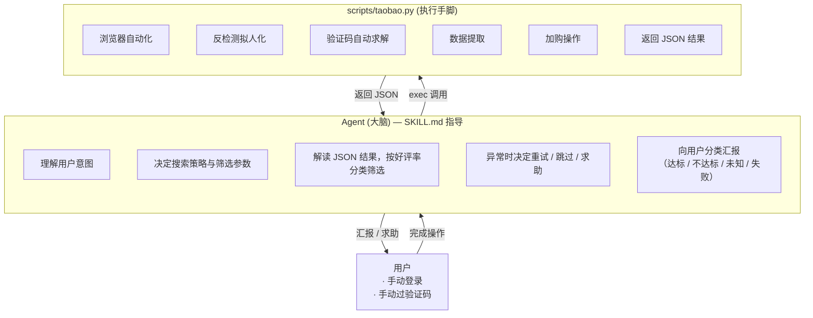

<div align="center">

# 🛒 淘宝自动挑货 · Taobao-Search-Skill

[](LICENSE)
[](https://www.python.org/)
[](https://playwright.dev/)
[](https://claude.ai/code)

</div>

> AI Agent 作为**大脑**替你逛淘宝 —— 理解自然语言需求，决定搜索策略与筛选参数，调用浏览器脚本执行操作，解读结构化结果，按好评率分类汇报（达标/不达标/未知/失败）。Agent 决策，脚本执行，边界清晰。

适用于 **Claude Code**、**Cursor**、**Copilot** 等 AI Agent 工具，也支持直接 CLI 调用。

## 架构



**核心设计：** Agent 是决策者，taobao.py 是执行器。脚本提取所有商品数据（含好评率）全部返回，Agent 自行分类筛选——脚本内部不做策略决策。中断信号（`need_login`/`need_captcha`）由 Agent 处理，用户介入后 `resume` 恢复。

### 决策归属审计

本 Skill 严格遵循 Agent-as-Brain 架构。以下是完整决策点归属：

| 决策点 | 归属 | 依据 |
|--------|------|------|
| 搜索关键词、价格区间、销量门槛 | **Agent** | SKILL.md §1 意图提取表 |
| 包邮/天猫筛选 | **Agent** | 通过 CLI 参数传递 |
| SKU 规格关键词 | **Agent** | 从用户语言中提取 |
| 最大候选数 | **Agent** | 用户指定或默认 5 |
| 好评率分类（达标/不达标/未知） | **Agent** | 读取 JSON `rating` 字段自行判断 |
| 结果汇报格式与内容 | **Agent** | SKILL.md §4 汇报模板 |
| 异常重试/跳过/求助 | **Agent** | SKILL.md §5 决策树 |
| 登录中断 → 通知用户 → resume | **Agent** | 收到 `need_login` 后执行 |
| 验证码中断 → 通知用户 → resume | **Agent** | 收到 `need_captcha` 后执行 |
| 无人值守模式选择 | **Agent** | `--no-manual-approval` 标志 |
| 浏览器启动/关闭 | taobao.py | 纯机械操作 |
| 会话恢复/保存 | taobao.py | 文件 I/O |
| 搜索执行、DOM 数据提取 | taobao.py | 纯执行 |
| 加购操作、SKU 匹配 | taobao.py | 根据 Agent 传入的关键词机械匹配 |
| 验证码自动求解尝试 | taobao.py | 纯算法，无策略选择 |
| 登录态检测 | taobao.py | 布尔判断，不做后续决策 |

> 唯一灰色地带：`--no-manual-approval` 未设置时，脚本会自行等待用户登录（最长 3.5 分钟）而非立即返回给 Agent。Agent 可通过设置该标志随时收回控制权。

### 严格意义上的 Skill

本 SKILL.md 不是简单的"运行这个命令"文档。它是符合 AI Agent Skill 规范的**行为指令集**：

| Skill 要素 | 本项目的实现 |
|------------|-------------|
| **合规声明** | 仅用于自有账号，禁止滥用 |
| **角色定义** | §0「你是决策者，taobao.py 是你的执行手脚」 |
| **前置检查** | 会话状态、依赖可用性、人工接管模式选择 |
| **意图理解** | §1 13 参数提取表 + 规则 + 默认值 + 示例 |
| **执行协议** | §2 三步执行法（构造→执行→解读→按 status 决策） |
| **中断处理** | §3 登录/验证码多轮交互 + 重试上限 + clear-session 兜底 |
| **决策框架** | §4 好评率分类 + 筛选判断 + 主动建议 + §5 异常决策树 |
| **汇报模板** | §4 达标/不达标/未知/失败四类格式 |
| **参考手册** | §6 常用操作 + 失败码表 + 依赖 + 多平台部署 |

对比普通脚本包装：脚本包装只告诉你 `run this command`；Skill 告诉你 `understand the user, decide parameters, interpret results, classify, report`。

### AI Agent 通用性

本 Skill 不依赖任何特定 Agent 框架的 API。Agent 只需要两个能力：**执行 Shell 命令** + **解析 JSON**。

| 平台 | 加载方式 | 权限配置 |
|------|----------|----------|
| Claude Code | `.claude/skills/taobao-search.md` | `settings.local.json` → `permissions.allow` |
| Cursor | `.cursor/rules/taobao-search.md` | Cursor Rules 配置 |
| GitHub Copilot | `.github/copilot-instructions.md` | 无额外配置 |
| OpenClaw | 框架 Skill 目录 | 按 OpenClaw 权限模型 |
| 任意终端 Agent | 读取 SKILL.md → 按指令执行 | 允许 `python scripts/taobao.py` |

Skill 逻辑本身零框架依赖 —— 只有标准 CLI 调用和 JSON 解析。

## 功能

- **AI 大脑决策** — Agent 理解自然语言意图，自动构造搜索参数；解读 JSON 结果后自行按好评率分类筛选，向用户分类汇报
- **会话持久化** — 首次人工登录后自动保存，后续运行跳过登录；过期时 Agent 主动提示重新登录
- **多维度筛选** — 价格/销量/包邮/天猫在搜索阶段过滤；好评率由 Agent 根据 taobao.py 返回的 rating 字段自行判断达标/不达标/未知
- **SKU 规格匹配** — 支持指定商品配置关键词（如"16G 512G"），自动匹配并选中
- **反检测拟人化** — playwright-stealth 注入反检测补丁，贝塞尔曲线鼠标轨迹、随机打字延迟、分段滚动
- **验证码自动求解** — ddddocr ML 模型 + OpenCV Canny 边缘检测双引擎，支持 GeeTest v3/v4
- **中断恢复** — 登录/风控时保存现场，Agent 通知用户介入后 resume 继续
- **结构化 JSON 输出** — 每步执行记录、匹配/跳过商品、截图证据、错误码

## 安装（给 AI Agent 看）

> 当用户提供本仓库地址要求安装时，作为 AI Agent 应自动完成以下步骤。

```bash
pip install -r requirements.txt
python -m playwright install chromium
```

然后将 `SKILL.md` 复制到平台 skill 加载路径（Claude Code → `.claude/skills/taobao-search.md`），并在权限配置中允许执行 `python scripts/taobao.py` 及其子命令。

## 使用

### 通过 AI Agent（推荐）

用自然语言描述需求，Agent 自动执行：

- "帮我在淘宝搜索苹果手机，好评率大于95%，前10个"
- "找便宜的蓝牙耳机，100以内包邮"
- "天猫上找索尼耳机，付款人数超1000，16G 512G规格"

Agent 理解意图 → 调用 `taobao.py search` → 收到 JSON（含每个商品的好评率）→ 自行按阈值分类 → 分类汇报。
如遇登录/验证 → Agent 提示你手动完成 → 你完成后 Agent 执行 `taobao.py resume` 继续。

### CLI

```bash
# 基础搜索
python scripts/taobao.py search --keyword "苹果手机" --price-max 10000

# 精确规格 + 筛选
python scripts/taobao.py search --keyword "Macbook m4" --price-max 6000 \
    --sku-keywords "16G 512G"

# 全量筛选
python scripts/taobao.py search --keyword "耳机" --rating-threshold 0.95 \
    --price-min 50 --price-max 500 --min-sales 1000 \
    --require-free-shipping --require-tmall yes

# 会话管理
python scripts/taobao.py check-session
python scripts/taobao.py clear-session

# 无头无人值守
python scripts/taobao.py search --keyword "鼠标" --headless --no-manual-approval
```

## 项目结构

```
SKILL.md                          # Agent 行为指令集（合规声明 + 角色定义 + 前置检查 + 意图理解 + 执行协议 + 中断处理 + 决策框架 + 汇报模板 + 多平台部署）
scripts/
├── taobao.py                     # 统一 CLI 入口（search / resume / check-session / clear-session）
├── browser_adapter.py            # 浏览器自动化（Playwright + stealth + 拟人化 + 数据提取）
├── slider_solver.py              # 验证码求解器（ddddocr + OpenCV 双引擎）
├── taobao_selectors.py            # 集中化 DOM 选择器（淘宝改版只改这一个文件）
├── session_manager.py            # 会话文件 I/O
├── session_flow.py               # 会话恢复/捕获编排
├── config.py                     # 配置解析
└── models.py                     # 数据模型（纯数据结构，不含序列化逻辑）
tests/
├── test_config.py                # 配置解析测试
├── test_models.py                # 数据模型测试
└── test_text_extraction.py       # 文本提取测试（价格/销量/好评率正则）
.cache/taobao-search-skill/       # 会话缓存与截图（自动创建，已 gitignore）
```

**测试：** 53 个单元测试覆盖配置解析、数据模型、文本提取正则。浏览器相关逻辑因需要真实浏览器环境，通过实际运行验证。

## 工作流

```
用户描述需求 → Agent 前置检查(会话/依赖) → 理解意图 → 构造参数 → exec taobao.py search
    → taobao.py: 恢复会话→登录检测→搜索→全量提取数据→加购→返回JSON(含好评率)
    → Agent 解读 JSON → 按好评率分类(达标/不达标/未知/失败) → 向用户汇报
    → [如需登录/验证] Agent 通知用户 → 用户完成后 → exec taobao.py resume
```

## 配置参数

| 参数 | 类型 | 默认值 | 说明 |
|------|------|--------|------|
| `--keyword` | str | `Sony headphones` | 搜索关键词 |
| `--rating-threshold` | float | `0` | 好评率阈值（Agent 用于分类汇报，脚本不筛选） |
| `--max-candidates` | int | `5` | 最多检查的候选商品数 |
| `--price-min` | float | — | 最低价格过滤（元） |
| `--price-max` | float | — | 最高价格过滤（元） |
| `--min-sales` | int | — | 最低付款人数 |
| `--require-free-shipping` | flag | — | 只要包邮商品 |
| `--require-tmall` | yes/no | — | 天猫/淘宝店筛选 |
| `--sku-keywords` | str | — | SKU 关键词，空格分隔（如 `"16G 512G"`） |
| `--no-screenshot` | flag | — | 禁用证据截图 |
| `--no-manual-approval` | flag | — | 禁用人工接管（遇到登录/验证直接返回中断信号） |
| `--headless` | flag | — | 无头模式运行浏览器 |
| `--session-state-path` | str | `.cache/...` | 会话持久化文件路径 |
| `--session-strategy` | str | `storage_state` | 会话恢复策略：`storage_state` / `cookie_localstorage` / `none` |
| `--report-channel` | str | `feishu` | 结果回传通道 |
| `--no-session-auto-save` | flag | — | 登录后不自动保存会话 |

## 环境要求

- Python 3.11+
- Playwright Chromium
- 依赖：`playwright>=1.45`、`playwright-stealth>=2.0`、`ddddocr>=1.4`、`opencv-python>=4.8`、`numpy>=1.24`

## License

MIT
