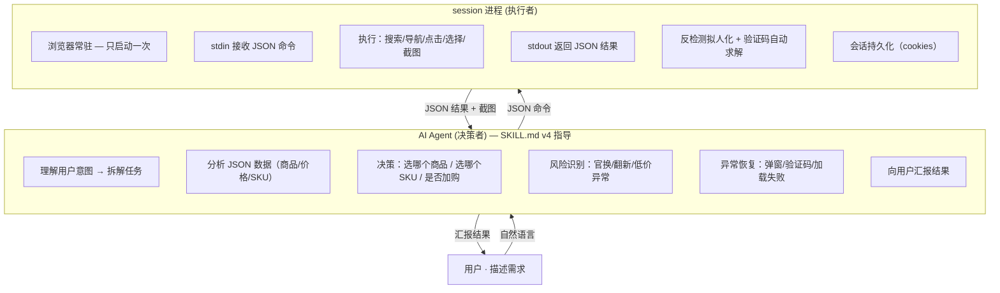

<div align="center">

# 🛒 淘宝自动挑货 · Taobao-Search-Skill

[](LICENSE)
[](https://www.python.org/)
[](https://playwright.dev/)
[](https://claude.ai/code)

</div>

> **AI Agent 替你逛淘宝** —— 用户只需描述需求，AI 理解意图后通过 JSON 命令操控浏览器完成搜索、筛选、选规格、加购全流程。浏览器常驻，命令实时响应。

适用于 **Claude Code**、**Cursor**、**Copilot** 等 AI Agent 工具。

## 架构



**核心思想：** 浏览器只启动一次，AI 通过 stdin/stdout JSON 协议发送命令、接收结果。命令间共享同一浏览器实例，无需反复启动。

### Session 协议

```bash
# 启动会话（浏览器打开一次）
python scripts/taobao.py session --task-id my-task

# 通过 stdin 发送命令，stdout 接收 JSON 结果
→ {"cmd": "search", "keyword": "MacBook Air M4", "price_max": 6000}
← {"status": "success", "data": {"items": [...], "items_count": 8}}

→ {"cmd": "open", "index": 0}
← {"status": "success", "data": {"sku_groups": [...], "detail_price": 5499}}

→ {"cmd": "select-sku", "selections": [{"label":"芯片","value":"M4"}, {"label":"内存","value":"16G"}]}
← {"status": "success", "data": {"final_price": 5999, "all_selected": true}}

→ {"cmd": "cart-add"}
← {"status": "success", "data": {"cart_added": true, "confirmed": true}}

→ {"cmd": "quit"}
```

### 命令集

| 命令 | 作用 | 关键返回数据 |
|------|------|------------|
| `search` | 搜索商品 | `items[]`（标题/价格/销量/评分/天猫标识） |
| `open` | 打开商品详情 | `sku_groups[]`（SKU 结构）+ `detail_price` |
| `select-sku` | 选择 SKU 规格（支持批量） | `final_price` + `selections[]`（选择结果） |
| `cart-add` | 加入购物车 | `cart_added` + `confirmed` |
| `cart-view` | 查看购物车 | `cart_item_count` + `items[]` |
| `dom` | 提取页面 DOM 结构 | `dom.elements[]`（按钮/链接/SKU 选项） |
| `screenshot` | 截取当前页面 | 截图路径 + 页面文本 |
| `quit` | 关闭浏览器退出 | — |

### 决策归属

| 决策点 | 归属 | 依据 |
|--------|------|------|
| 选择哪个商品 | **AI** | JSON 数据（价格/销量/评分/天猫标识） |
| 选择哪个 SKU | **AI** | `sku_groups` 结构化数据 |
| 价格是否在预算内 | **AI** | `final_price` 数值 |
| 是否跳过风险商品 | **AI** | 标题正则匹配（官换/翻新/后封/二手） |
| 异常处理 | **AI** | 错误码 + 截图排查 |
| 浏览器操控 | session 进程 | 纯执行 |
| 反检测/验证码 | session 进程 | 纯算法 |

## 功能

- **Session 模式** — 浏览器常驻，通过 stdin/stdout JSON 协议通信，命令间零启动开销
- **AI 决策驱动** — AI 分析结构化 JSON 数据做决策，截图仅在异常排查时使用
- **批量 SKU 选择** — 一次命令选择多个规格（芯片+内存+硬盘），脚本内部依次执行
- **风险识别** — AI 用正则匹配标题中的"官换""翻新""后封""二手"等风险词
- **会话持久化** — 首次人工登录后自动保存 cookies，后续运行跳过登录
- **反检测拟人化** — playwright-stealth 注入反检测补丁，贝塞尔曲线鼠标轨迹、随机打字延迟、分段滚动
- **验证码自动求解** — ddddocr ML 模型 + OpenCV Canny 边缘检测双引擎，支持 GeeTest v3/v4

## 安装

```bash
pip install -r requirements.txt
python -m playwright install chromium
```

然后将 `SKILL.md` 复制到平台 skill 加载路径（Claude Code → `.claude/skills/taobao-search.md`），并在权限配置中允许执行 `python scripts/taobao.py` 及其子命令。

```json
{
  "permissions": {
    "allow": [
      "python scripts/taobao.py session *",
      "python scripts/taobao.py check-session",
      "python scripts/taobao.py clear-session"
    ]
  }
}
```

## 使用

### 通过 AI Agent（推荐）

用自然语言描述需求，Agent 自动完成搜索→筛选→选规格→加购全流程：

- "帮我在淘宝上挑选6000元以下的MacBook Air M4芯片版本，16+512，13寸或者15寸屏幕都可以"
- "找便宜的蓝牙耳机，100以内包邮"
- "天猫上找索尼耳机，付款人数超1000"

### CLI

```bash
# 启动持久会话（浏览器常驻，通过 stdin 发送 JSON 命令）
python scripts/taobao.py session --task-id my-task

# 会话管理
python scripts/taobao.py check-session
python scripts/taobao.py clear-session
```

## 工作流示例

```
用户："帮我找6000以下MacBook Air M4 16+512"

AI 操作序列：

1. 启动会话
   python scripts/taobao.py session --task-id macbook

2. 搜索
   → {"cmd":"search","keyword":"MacBook Air M4 16G 512G","price_max":6000}
   ← 8 个候选商品（含标题/价格/销量/评分/天猫标识）

3. 打开第 0 个（¥5499，天猫，好评 98%）
   → {"cmd":"open","index":0}
   ← SKU 结构：芯片(M4/M3) + 内存(16G/24G) + 硬盘(256G/512G/1T)

4. 批量选择规格
   → {"cmd":"select-sku","selections":[
       {"label":"芯片","value":"M4"},
       {"label":"内存","value":"16G"},
       {"label":"硬盘","value":"512G"}
     ]}
   ← final_price: 5999, all_selected: true
   判断：5999 < 6000 ✓

5. 加购
   → {"cmd":"cart-add"}
   ← cart_added: true, confirmed: true

6. 退出
   → {"cmd":"quit"}

汇报：✅ 已加购 MacBook Air M4 16G+512G — ¥5,999 — 天猫 — 好评 98% — 包邮
```

## 项目结构

```
SKILL.md                          # Agent 行为指令集 v4（Session 模式协议 + 命令参考 + 决策框架）
scripts/
├── taobao.py                     # CLI 入口（session/check-session/clear-session）
├── browser_adapter.py            # 浏览器自动化（搜索/导航/点击/SKU选择/截图/DOM提取/反检测）
├── taobao_selectors.py           # 集中化 DOM 选择器
├── slider_solver.py              # 验证码求解器（ddddocr + OpenCV 双引擎）
├── session_manager.py            # 会话文件 I/O（cookies 持久化）
├── session_flow.py               # 会话恢复/捕获编排
├── config.py                     # 配置解析
└── models.py                     # 数据模型（MatchedItem/VisualState 等）
tests/
├── test_config.py                # 配置解析测试
├── test_models.py                # 数据模型测试
└── test_text_extraction.py       # 文本提取测试（价格/销量/好评率正则）
.cache/taobao-search-skill/       # 会话缓存 + 截图（自动创建，已 gitignore）
```

## 环境要求

- Python 3.11+
- Playwright Chromium
- 依赖：`playwright>=1.45`、`playwright-stealth>=2.0`、`ddddocr>=1.4`、`opencv-python>=4.8`、`numpy>=1.24`

## License

MIT
